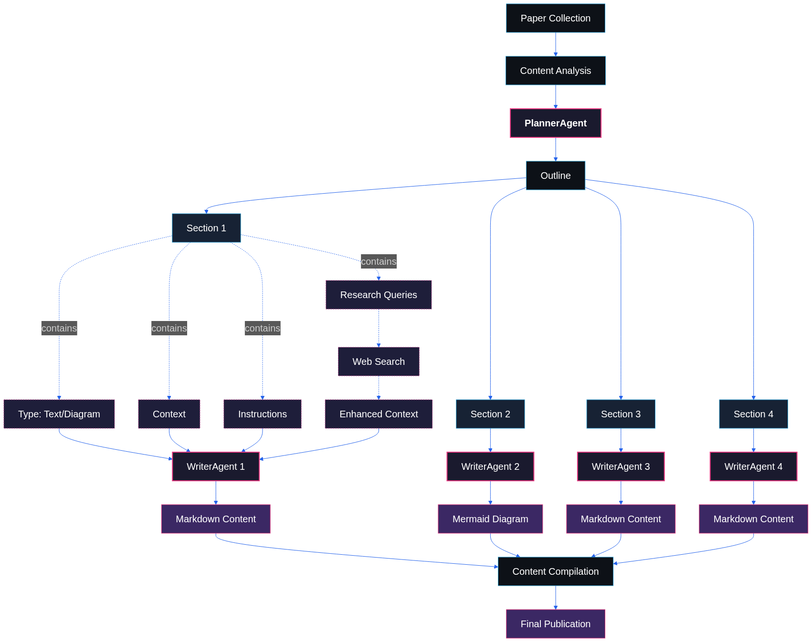

# RecursivAI

RecursivAI is an AI-generated blog that keeps you up-to-date with the latest breakthroughs in the world of AI, explained in simple terms. It’s perfect for anyone who’s curious about AI but finds it tough to keep up.

This project has two main components: a research pipeline and a news engine.

## Research Pipeline

The research pipeline is designed to go deep into the latest AI research papers and make them accessible to everyone.

Here's a simplified overview of how it works:

1.  **Discovery and Collection:** The system automatically finds the most significant new AI research papers from PapersWithCode, based on community interest (GitHub stars).
2.  **Analysis and Planning:** A **PlannerAgent** (powered by an LLM) reads a paper and creates a detailed outline, breaking it down into sections. Each section is tagged as either "text" or "diagram" and includes context and instructions for the next step.
3.  **Research Enhancement:** Before content is written, **WriterAgents** perform web searches to gather additional context, ensuring the explanations are comprehensive.
4.  **Content Generation:** Multiple **WriterAgents** work in parallel to process the sections. They generate easy-to-understand text explanations and Mermaid diagrams to visualize complex concepts.
5.  **Publication:** The generated content is compiled into a final blog post and published.

## News Engine

The news engine is designed for breadth and speed, capturing the daily pulse of the AI world.

1.  **Collection:** A scheduled job scrapes a curated list of RSS feeds, APIs, and news sources, and performs general web searches to find relevant articles from the last 24 hours.
2.  **Filtering & Ranking:** The collected articles are passed to an LLM which acts as a filter, removing noise and irrelevant content. It then ranks the remaining articles by significance (e.g., model releases, acquisitions, major breakthroughs).
3.  **Content Generation:** For each top-ranked article, a generative pipeline kicks in:
    *   An LLM generates a concise **headline, subheading, and summary**.
    *   A specialized prompt engineering model takes the headline and creates a detailed, artistic prompt for an image generator.
    *   An image model uses this prompt to generate a high-quality, visually consistent **featured image**.
4.  **Publication:** The processed articles, complete with generated content and images, are published to the site's front page.

Check it out!
