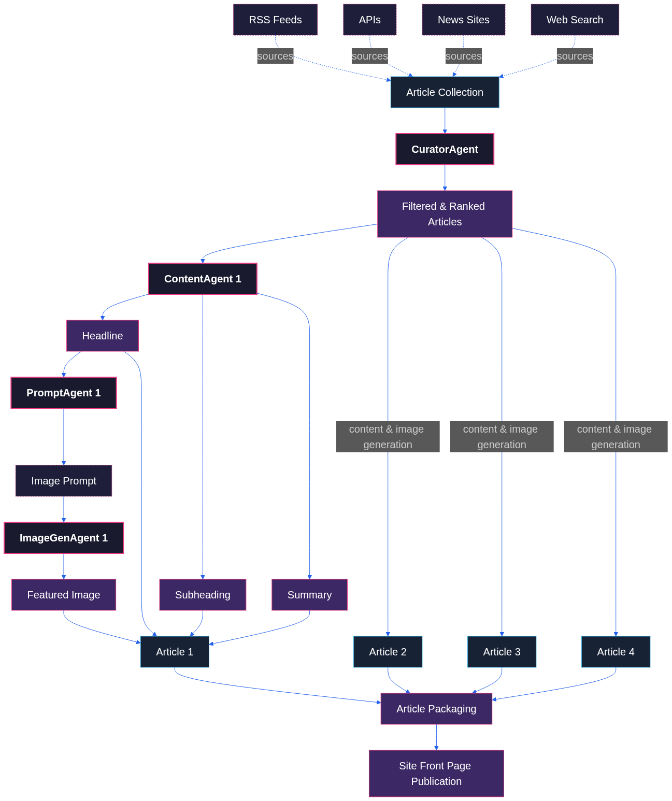
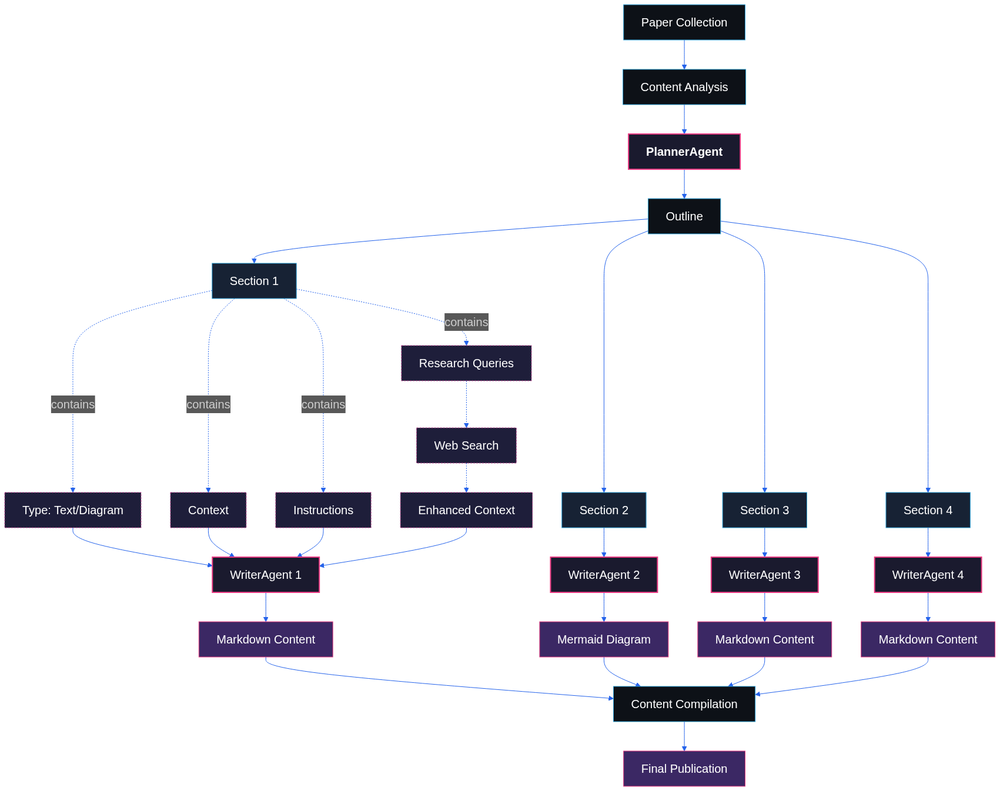

# RecursivAI

RecursivAI is a fully autonomous AI newsroom and research desk. It keeps busy engineers, PMs, and tech leaders up to speed on what actually changed in AI—without the hype or doomscrolling.

The project now centers on its daily news briefing, with deep-dive research explainers still available for extended context.

## News Engine

The news engine is optimized for breadth and speed, capturing the daily pulse of the AI world and crafting it into a no-nonsense briefing.

1.  **Collection:** A scheduled job scrapes a curated list of RSS feeds, APIs, newsletters, and web searches to surface relevant items from the past 24 hours.
2.  **Filtering & Ranking:** An LLM filter removes noise, scores significance (model launches, funding, regulation, etc.), and prioritizes the top stories.
3.  **Content Generation:** For each selected item, the autonomous pipeline:
    *   Drafts the headline, subheading, and summary in a concise tone.
    *   Creates a detailed prompt for the image generator.
    *   Produces a featured image that keeps the visual style consistent.
4.  **Publication:** The finished pieces are pushed to the front page and newsletter so readers can scan the day’s AI shifts in minutes.

## Research Pipeline

The research pipeline goes deep on seminal papers, translating dense technical work into approachable explainers and diagrams.

1.  **Discovery and Collection:** The system tracks notable new papers from PapersWithCode and related sources, guided by community momentum (GitHub stars).
2.  **Analysis and Planning:** A **PlannerAgent** (LLM) outlines each paper, labeling sections as text or diagram work with the necessary context.
3.  **Research Enhancement:** Before writing, **WriterAgents** run targeted web searches to capture the broader conversation and fill knowledge gaps.
4.  **Content Generation:** Multiple **WriterAgents** write readable summaries and produce Mermaid diagrams that distill complex architectures.
5.  **Publication:** Everything is assembled into a long-form post ready for the site and syndication.

Check it out!
