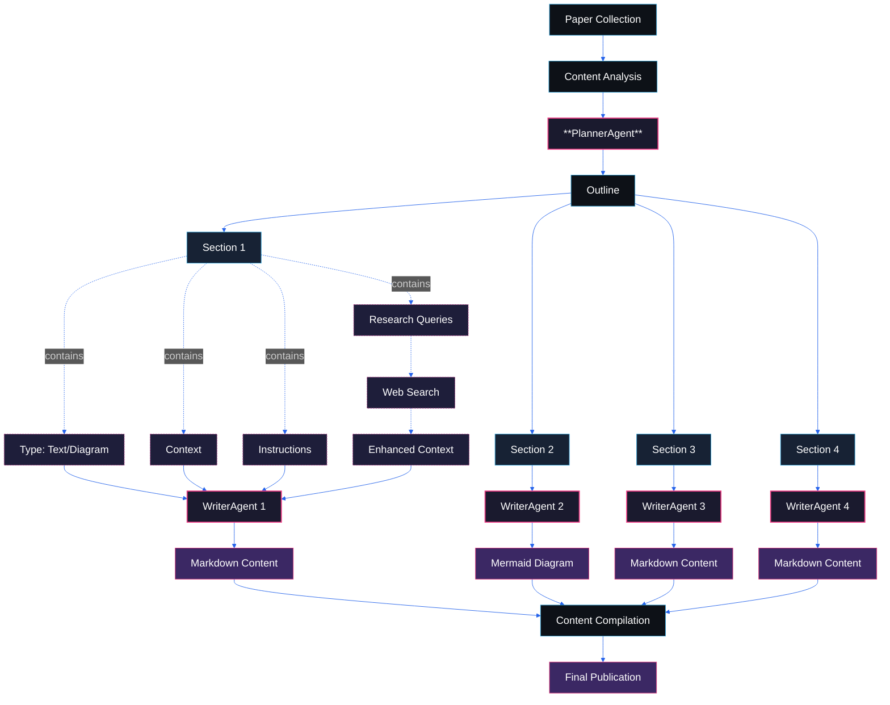

# Hi! Welcome to RecursivAI
RecursivAI is an AI-generated blog that keeps you up-to-date with the latest breakthroughs in AI research, explained in simple terms. It’s perfect for anyone who’s curious about AI but finds it tough to keep up.

## The Goal
AI research moves so fast sometimes, it feels like only AI can keep up. That’s the idea behind **RecursivAI**! This blog is fully powered by AI to find the most important new AI research, break it down, and explain it in a way anyone can understand.

I also want this project to run itself as much as possible—smoothly, with almost no human intervention.

It’s still a work in progress, and I’ve got a lot of plans to improve it. Got ideas or feedback? I’d love to hear from you!

[LinkedIn](https://www.linkedin.com/in/ishaan-bhartiya/) | [Email](mailto:ish.bhartiya@gmail.com)

## Who it's for
I started this because I felt swamped by all the AI news. I wanted to stay on top of things but didn’t have the time or skills to dig into research papers myself.

I made this blog for people like me, who are interested in AI, but just can’t seem to keep up! **RecursivAI** takes the tricky stuff and makes it simple, while still keeping the heart of the research intact.

## How it works

1. **Discovery and collection**
    - It searches for the latest AI research using the PapersWithCode API, picking papers with the highest number of GitHub stars. This was the simplest and most reliable way. Other sources (HackerNews, Reddit, RSS, Tavily Search) gave a lot of false positives, mixing in catchy headlines and fluff news.
2. **Analysis and Planning**
    - Extract the text from the paper and pass it to the **PlannerAgent**
    - PlannerAgent analyzes the text and generates a detailed outline, composed of specialized sections
    - Each section is either of type "text" or "diagram". It contains all necessary context from the paper, along with instructions for the **WriterAgent**
    - Each section is accompanied with a list of queries to fill in extra information not in the paper
3. **Research Enhancement**
    - **WriterAgents** use *Tavily* to execute the queries.
    - Response is added to the section context
4. **Content Generation**
    - **WriterAgents** process each section in parallel, according to the context and instructions
    - Text sections are transformed into a clear, easy-to-understand explanation
    - Diagram sections are converted to Mermaid diagrams
5. **Publication**
    - The sections are compiled into a coherent blog post
    - The post is automatically published to the blog

## Next Steps
Like I said, this project is still a work in progress. Here are some immediate plans:
- More sources, including company blogs like DeepMind, OpenAI, etc.
- Better PDF parsing, extracting visual info
- Generation of more complex diagrams, different charts, etc.
- Generation of code snippets and eventually interactive demos
- A more agentic workflow, giving LLMs more control over the process
    - Examples: Editor Agent for iterative feedback, In depth research, etc. 

## Tech Stack
- Frontend: React, TailwindCSS
- Backend: FastAPI, SQLite
- LLM: Gemini Flash 2.0 (**THANK YOU DEEPMIND FOR THE AMAZING FREE API TIER**)
- Search: Tavily (**THANK YOU FOR THE FREE STUDENT ACCESS**)

I decided to not use any LLM frameworks for this project, as I wanted to have more control over the workflow, and not be distracted dealing with layers of abstraction.

