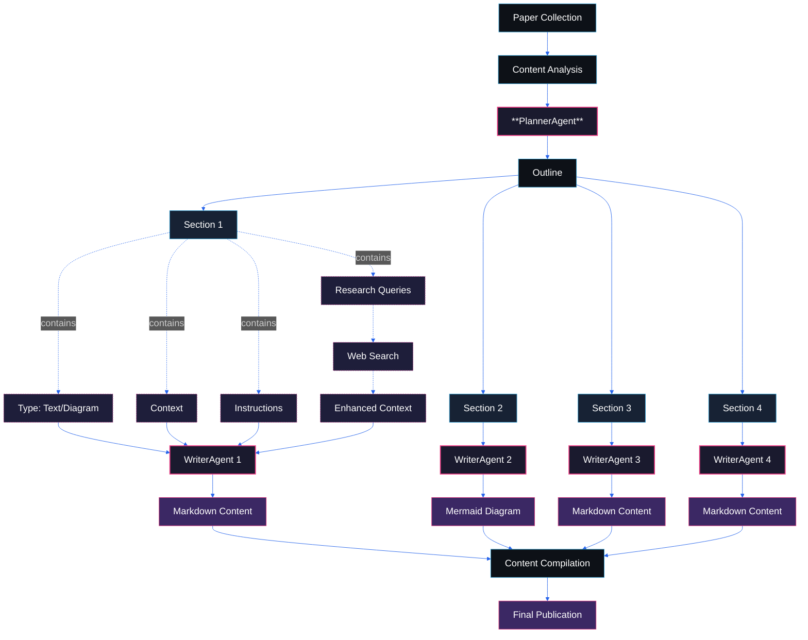
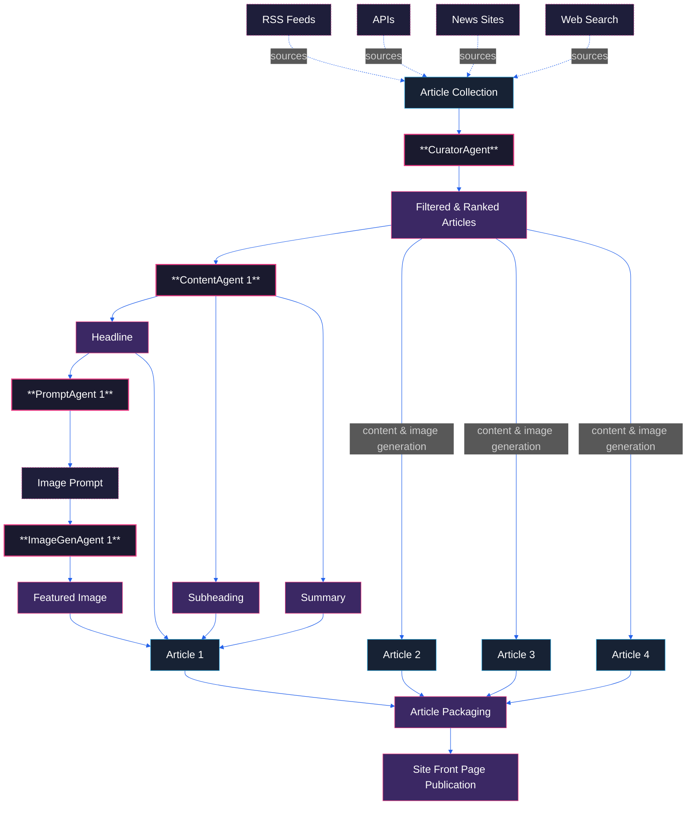

# Hi! Welcome to RecursivAI
RecursivAI is an AI-generated blog that keeps you up-to-date with the latest breakthroughs in the world of AI, explained in simple terms. It’s perfect for anyone who’s curious about AI but finds it tough to keep up.

**This is the only human-generated content on this platform.**

## The Goal
The world of AI moves so fast, it feels like only AI can keep up. That’s the idea behind **RecursivAI**! This blog is fully powered by AI to find the most important developments, break them down, and explain them in a way anyone can understand.

I also want this project to run itself as much as possible—smoothly, with almost no human intervention.

It’s still a work in progress, and I’ve got a lot of plans to improve it. Got any ideas or feedback? I’d love to hear from you! (Links below)

## Who it's for
I started this because I felt swamped by all the AI news and research. I wanted to stay on top of things but didn’t always have the time or skills to dig into dense papers and articles myself.

I made this blog for people like me, who are interested in AI but just can’t seem to keep up! **RecursivAI** takes the tricky stuff and makes it simple, while still keeping the core concepts intact.

## How it works
This project has two main components: a research pipeline and a news engine.

### Research Pipeline
The research pipeline is designed to go deep into the latest AI research papers and make them accessible to everyone.

1. **Discovery and collection**
    - It searches for the latest AI research using the PapersWithCode API, picking papers with the highest number of GitHub stars. This was the simplest and most reliable way. Other sources (HackerNews, Reddit, RSS, Tavily Search) gave a lot of false positives, mixing in catchy headlines and fluff news.
2. **Analysis and Planning**
    - Extract the text from the paper and pass it to the **PlannerAgent**
    - PlannerAgent analyzes the text and generates a detailed outline, composed of specialized sections
    - Each section is either of type "text" or "diagram". It contains all necessary context from the paper, along with instructions for the **WriterAgent**
    - Each section is accompanied with a list of queries to fill in extra information not in the paper
3. **Research Enhancement**
    - **WriterAgents** use *Tavily* to execute the queries.
    - Response is added to the section context
4. **Content Generation**
    - **WriterAgents** process each section in parallel, according to the context and instructions
    - Text sections are transformed into a clear, easy-to-understand explanation
    - Diagram sections are converted to Mermaid diagrams
5. **Publication**
    - The sections are compiled into a coherent blog post
    - The post is automatically published to the blog

### News Engine
The news engine is designed for breadth and speed, capturing the daily pulse of the AI world.

1.  **Collection:** A scheduled job scrapes a curated list of RSS feeds, APIs, and news sources, and performs general web searches to find relevant articles from the last 24 hours.
2.  **Filtering & Ranking:** The collected articles are passed to an LLM which acts as a filter, removing noise and irrelevant content. It then ranks the remaining articles by significance (e.g., model releases, acquisitions, major breakthroughs).
3.  **Content Generation:** For each top-ranked article, a generative pipeline kicks in:
    *   An LLM generates a concise **headline, subheading, and summary**.
    *   A specialized prompt engineering model takes the headline and and creates a detailed, artistic prompt for an image generator.
    *   An image model uses this prompt to generate a high-quality, visually consistent **featured image**.
4.  **Publication:** The processed articles, complete with generated content and images, are published to the site's front page.

## Next Steps
Like I said, this project is still a work in progress. Here are some immediate plans:
- Better PDF parsing, extracting visual info
- Generation of more complex diagrams, different charts, etc.
- Generation of code snippets and eventually interactive demos
- A more agentic workflow, giving LLMs more control over the process
    - Examples: Editor Agent for iterative feedback, In depth research, etc. 

## Tech Stack
- Frontend: React, TailwindCSS
- Backend: FastAPI, Supabase
- LLM: Gemini
- Search: Tavily

I decided not to use any LLM frameworks for this project because I wanted more control over the workflow and didn't want to be distracted by abstractions.

## About Me
I'm Ishaan, a software engineer with an interest in AI.

I love exploring new ideas and experimenting, so if you have an interesting proposal, AI or otherwise, please reach out!

[LinkedIn](https://www.linkedin.com/in/ishaan-bhartiya/) | [GitHub](https://github.com/ib565) | [Email](mailto:ish.bhartiya@gmail.com) 
